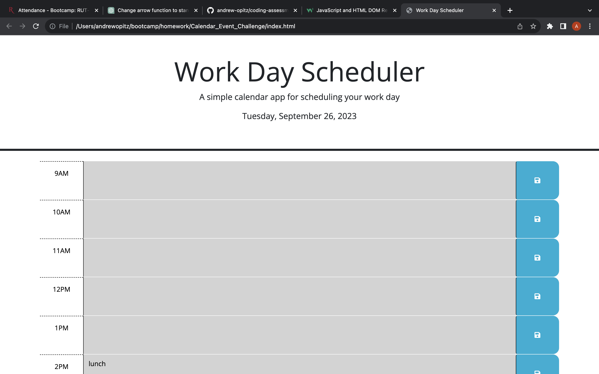
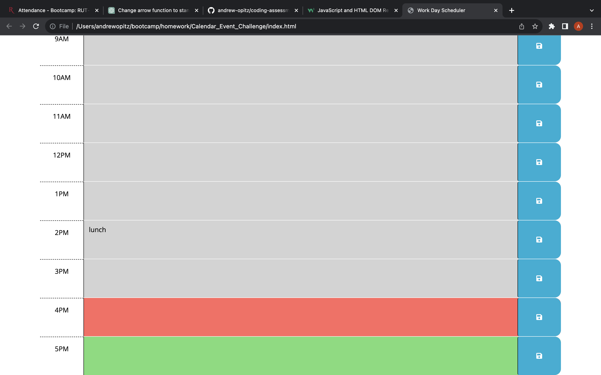

# Calendar_Event_Challenge
[LiveSite](https://andrew-opitz.github.io/Calendar_Event_Challenge/)

## Description
This website was created to store events to a work day calendar to organize the tasks for the day. It utilizes local storage to save the events so they will be displayed on page load. The hour blocks are color-coded to show the past, present and future hours. 

## Installation
N/A

## Usage 

## Credits

N/A

## License 

Please refer to the license in the repo.

